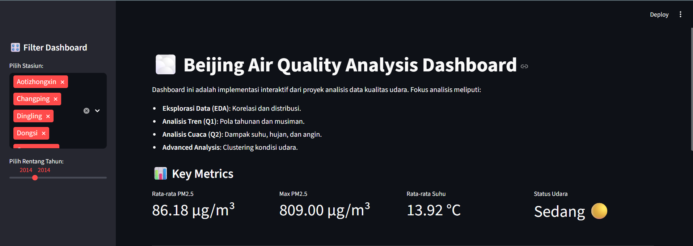
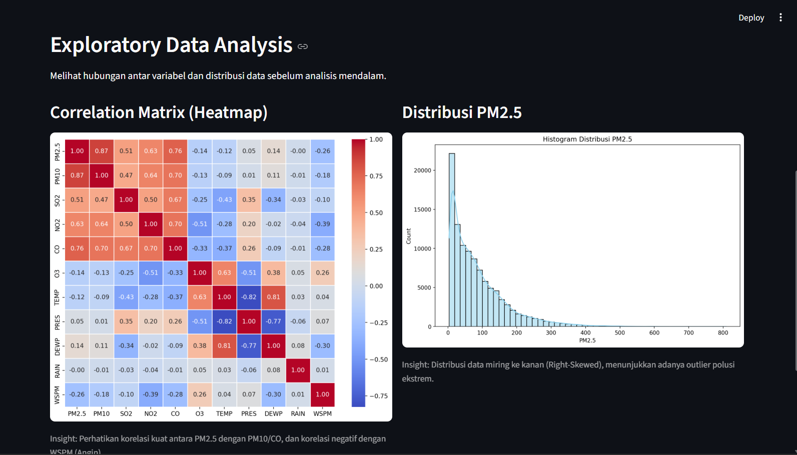
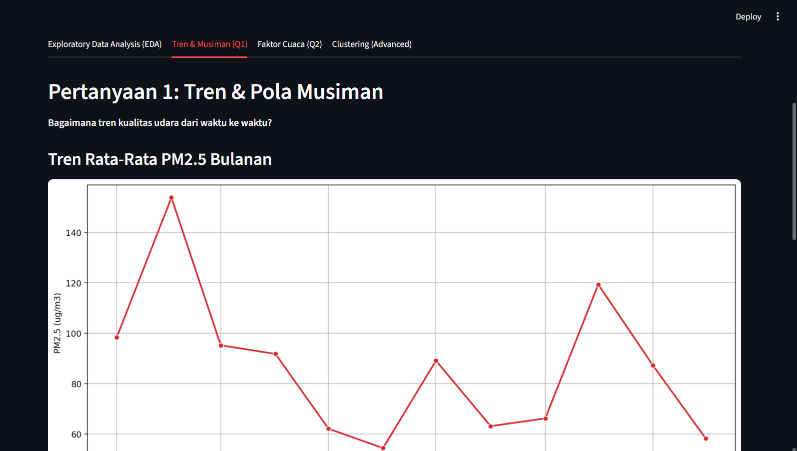
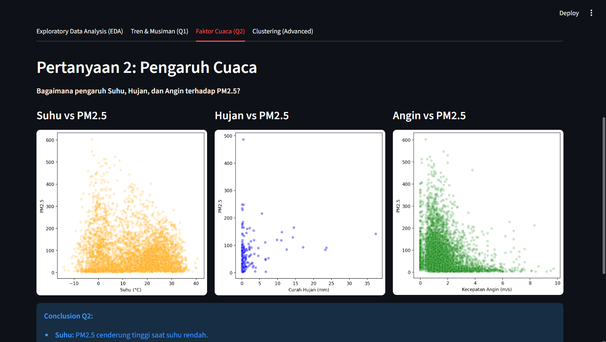
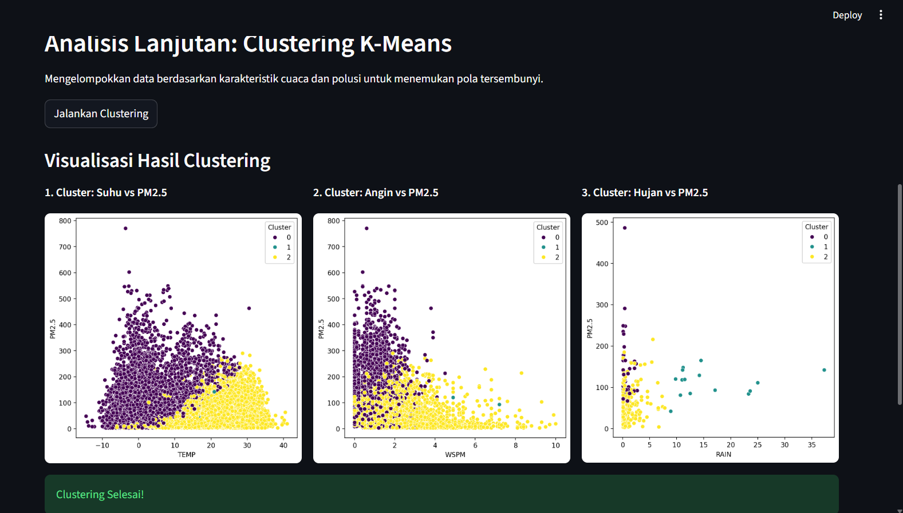

# Beijing Air Quality Analysis Dashboard 🌫️

## Deskripsi Proyek
Proyek ini bertujuan untuk menganalisis kualitas udara di Beijing menggunakan dataset *time-series* dari 12 stasiun pemantauan utama. Analisis ini mencakup eksplorasi data (EDA), analisis tren musiman, pengaruh faktor cuaca terhadap polusi (PM2.5), serta penerapan *Unsupervised Machine Learning* (K-Means Clustering) untuk mengelompokkan kondisi kualitas udara.

Hasil analisis disajikan dalam bentuk dashboard interaktif berbasis **Streamlit** untuk memudahkan eksplorasi data.

🔗 **Link Dashboard:** [Masukkan Link Streamlit App Anda di Sini]

## 📂 Dataset
Dataset yang digunakan adalah **Beijing Multi-Site Air-Quality Data**.
- **Sumber:** [GitHub - marceloreis/HTI](https://github.com/marceloreis/HTI/tree/master)
- **Rentang Waktu:** 1 Maret 2013 - 28 Februari 2017
- **Fitur Utama:**
    - `PM2.5`, `PM10`, `SO2`, `NO2`, `CO`, `O3` (Konsentrasi Polutan)
    - `TEMP` (Suhu), `PRES` (Tekanan), `DEWP` (Titik Embun), `RAIN` (Curah Hujan), `WSPM` (Kecepatan Angin), `wd` (Arah Angin)

## ⚙️ Setup Environment - Anaconda
```bash
conda create --name main-ds python=3.9
conda activate main-ds
pip install -r requirements.txt
```

## ⚙️ Setup Environment - Shell/Terminal
```bash
mkdir submission
cd submission
pipenv install
pipenv shell
pip install -r requirements.txt
```

## 🚀 Cara Menjalankan Dashboard Lokal

```bash
streamlit run dashboard.py
```
Dashboard akan otomatis terbuka di browser (biasanya di `http://localhost:8501`).

## 📊 Ringkasan Insight & Analisis

### 1. Eksplorasi Data (EDA)
- **Korelasi:** Terdapat korelasi positif yang sangat kuat antara **PM2.5** dan **PM10** (0.88) serta **CO** (0.79), menunjukkan sumber polusi yang serupa. Sebaliknya, **Kecepatan Angin (WSPM)** memiliki korelasi negatif, yang berarti angin membantu mengurangi polusi.
- **Distribusi:** Data PM2.5 memiliki distribusi *right-skewed*, yang berarti sebagian besar hari memiliki udara relatif bersih, namun terdapat kejadian polusi ekstrem (outlier) yang signifikan.

### 2. Pola Musiman & Tren
- Kualitas udara memburuk secara signifikan pada **Musim Dingin (November - Februari)**.
- Lonjakan polusi ini kemungkinan besar disebabkan oleh peningkatan aktivitas pembakaran (pemanas ruangan) dan kondisi atmosfer yang stagnan (inversi suhu) di musim dingin.

### 3. Pengaruh Cuaca
- **Suhu (TEMP):** Berkorelasi negatif dengan PM2.5. Suhu rendah cenderung berkaitan dengan polusi tinggi.
- **Hujan (RAIN) & Angin (WSPM):** Berperan sebagai "pembersih alami". Konsentrasi PM2.5 menurun drastis saat curah hujan tinggi atau kecepatan angin meningkat.

### 4. Clustering (K-Means)
- Data dikelompokkan menjadi 3 cluster utama:
    - **Cluster Bersih:** Ditandai dengan angin kencang atau hujan.
    - **Cluster Sedang:** Kondisi cuaca stabil.
    - **Cluster Sangat Kotor:** Didominasi oleh suhu rendah, angin tenang, dan tanpa hujan (khas musim dingin).

## 📸 Screenshots Dashboard

### 1. Tampilan Utama Dashboard & Key Metrics


### 2. Exploratory Data Analysis



### 3. Analisis Tren & Musiman


### 4. Analisis Faktor & Cuaca


### 5. Clustering Analysis


---
**Created by Muhammad Arief Pratama | ML Assignment GDGoC 2025**
